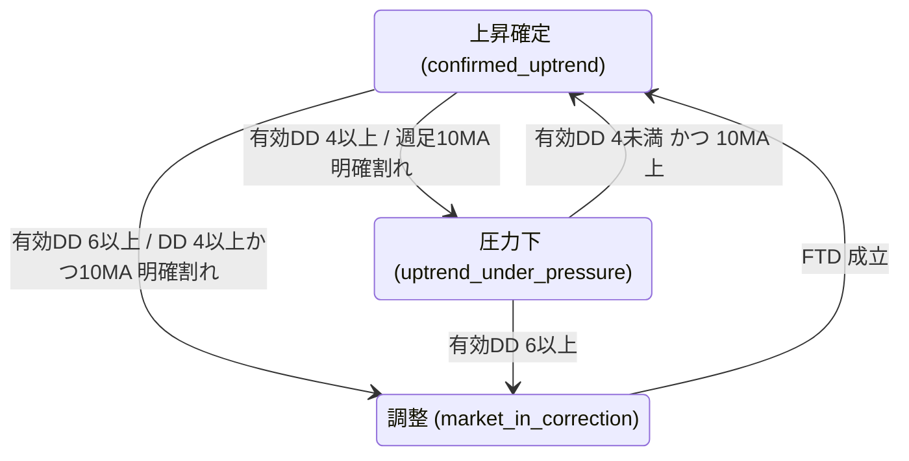

# 市場ステート仕様

指数ごとに、O'Neil / IBD の原典に沿った3状態で相場の地合いを判定する (#117)。
判定は I/O を持たない純関数 (`scripts/market_state.py`) で、閾値は同モジュールの定数、遷移ルールの全体は `derive_state` の docstring を正とする。
永続化は市場DBの各指数 dict (`market_state` / `state_meta` / `state_history`) で行う。

## 3つの状態

初回 (前日の状態が無い) は、その日の有効DD数だけで3状態のどれかに置く (10MA の補助ルールは使わない)。

## 判定に使う事象

| 事象 | 定義 |
|---|---|
| ディストリビューションデイ (DD) | 前日比 -0.2% 以下 かつ 出来高が前日より多い日 |
| ストーリングデイ | 52週高値の97%以上の水準で、微増 (0〜+0.4%)・出来高増・日足の下半分で引けた日。DD として数える |
| DD の失効 | 25取引日が経過した、または指数が DD 発生日の終値の1.05倍以上に戻した。取得窓から外れた DD も失効扱い (古い DD が残って状態が張り付かないように) |
| ラリーアテンプト | 調整中に前日より高く引けた日を Day 1 とし、その安値を記録する。Day 1 の安値を割ったら取り消す |
| フォロースルーデイ (FTD) | ラリー Day 4 以降に、+1.0% 以上 かつ 出来高が前日より多い日 |
| 週足10MA 明確割れ | 週足10MA からの乖離が -1% 以下。日足50MA の代わりに使う (10週 ≈ 50営業日) |

## 対象指数

TOPIX / グロース250 (DB キーは `mothers`) / 日経225 / NASDAQ / S&P500。各指数が独立に状態を持つ。
運用比率ガイド (`exposure_guide.py`) は、保有額で加重した市場ステートを使う。

## 採用しなかった案

| 案 | 理由 |
|---|---|
| ボラティリティ連動の FTD 閾値 (200日HV で 0.7〜1.245%) | 日足データを大きく延ばす必要があり、効果に見合わない。固定 1.0% で運用する |
| 個別銘柄のシグナルに市場ステートを反映する (`[ブ?]` / `[ブ!]` など) | ユーザー判断で実装しない。市場表示の精度向上に振り替えた |
| 日足50MA による遷移 | 日足データの延長が要るため、週足10MA で代替した |
| Minervini Breadth (トレンドテンプレート通過銘柄数) | 優先度が低く保留 |
