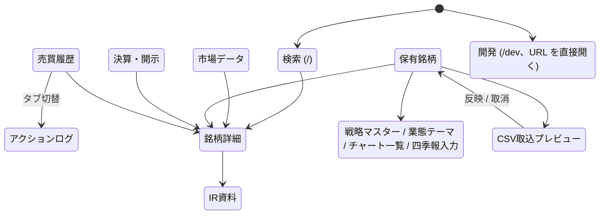

# アーキテクチャ

Shintakane のデータの流れ、モジュールとデータストアの責務、設計の意図をまとめる。
**関数名・定数値・キー一覧などの実装の詳細は書かない**。それらはコードの docstring を正とする ([AI開発原則.md](AI開発原則.md))。
用語は [用語集と不変条件.md](用語集と不変条件.md)、却下した案は [decisions/](decisions/README.md)、運用は [運用手順.md](運用手順.md)、コマンドは [コマンド一覧.md](spec/コマンド一覧.md) を参照。

## 1. 全体像

```text
 外部ソース                         日次バッチ (平日19時)                  データストア                 利用者の入口
 ─────────                         ────────────────────                  ────────────                 ─────────────
 株探 (新高値・決算・テーマ・指標) ─┐                                   ┌─ stocks_shelve (揮発)  ──┐
 Yahoo Finance (yfinance)          ├→ shintakane.py ─→ make_stock_db.py ┼─ market_db_shelve (揮発) ├→ WebApp (保有・売買・市場・開示・銘柄詳細)
 nikkei225jp (信用・VI・F&G)        │   (+ 市場DB更新)   (+ 調査DB追記)   ├─ research_shelve (蓄積)  ├→ CSV → Google Sheets (code_rank / shintakane_result)
 TDnet/株探 開示・会社IRページ ─────┤                                   ├─ portfolio_shelve (蓄積) ├→ MCP サーバー → ChatGPT / Claude
 証券会社CSV (手動DL・週次) ────────┤→ exposure_guide.py → theme-news    ├─ stock_ratings (JSON)    │
 四季報 (手入力) / ChatGPT の評価 ──┘   (claude -p)      (金曜 compact) └─ ir_docs / disclosure ──┘
```

役割分担は「Shintakane = 記録・数値・監視・規律、LLM = 調査・解釈・反証、人間 = 最終判断」([AI投資活用戦略.md](AI投資活用戦略.md))。
Shintakane は数値を集めて記録し、規律を強制する側に徹し、解釈は LLM と人間に渡す。

## 2. 日次バッチ

`shintakane_cron.sh` が平日19時に次の順で実行する (launchd、運用機のみ)。

1. `shintakane.py` — 株探から新高値・出来高急増・決算発表を取り込み、候補銘柄の DB を更新して `shintakane_result.csv` を出す。**市場DB (テーマランク・指数・市場ステート) もここで更新する**
2. `make_stock_db.py` — 全銘柄の DB を更新し、総合スコアで順位付けして `code_rank.csv` を出す。末尾で調査DBへ決算スナップショットを追記し、不可逆DB (research / portfolio) のバックアップを取る
3. `exposure_guide.py log` — 市場ステートが更新済みである必要があるので `make_stock_db.py` の後。運用比率を日次ログに残す
4. `run_theme_news.py` — `make_stock_db.py` が成功したときだけ。急浮上テーマの理由を `claude -p` で調べる
5. 金曜のみ `make_stock_db.py compact` — stocks_shelve の肥大を解消する

各段は失敗しても次へ進む (theme-news を除く)。結果は `report` で要約し、ログに残す。

## 3. データストアと分離原則

| ストア | 性質 | 書き手 | 消えたら |
|---|---|---|---|
| `stocks_shelve` | 揮発キャッシュ (最新値で上書き) | 日次バッチ | スクレイピングで再構築できる |
| `market_db_shelve` | 揮発キャッシュ + 市場ステート履歴 | 日次バッチ | 大半は再構築できる |
| `research_shelve` | **蓄積資産** (手動メモ + 決算スナップショット時系列) | WebApp・日次バッチ | 復元できない |
| `portfolio_shelve` | **蓄積資産** (保有ステータス・判断ログ・約定・戦略) | WebApp・取込 CLI | 復元できない |
| `stock_ratings/` (JSON + 履歴 JSONL) | **蓄積資産** (ChatGPT で付けた評価) | `stock_ratings.py` / MCP | 復元できない |
| `ir_docs/` | 収集した IR 資料 (PDF + ページ単位テキスト) | `ir_docs.py`・WebApp | 再収集できる (中計の選択は手作業) |
| `disclosure/` | 適時開示のキャッシュ | 日次・WebApp | 再取得できる |
| `theme_news/` | theme-news の生成履歴 | `run_theme_news.py` | 再生成できない (LLM 出力) |

保有管理は空の `portfolio_shelve` から開始できる。空であることを未移行状態とは扱わず、銘柄追加・CSV取込・テーマや戦略の管理を通常どおり利用できる。

- **揮発と蓄積を別 DB に分ける**。揮発 DB は壊れても作り直せるので、日次で大胆に上書き・compact する。蓄積 DB は日次で14世代バックアップし、手動資産を自動処理で上書きしない
- **依存は一方向**。stocks → research / portfolio は読むだけ。portfolio は stocks と research を読むが、逆はない
- **shelve (`dbm.dumb`) を使う理由**: macOS の `dbm.ndbm` はハッシュ衝突で壊れるため。SQLite 化 (#450) は将来課題
- 評価台帳は shelve に入れず JSON にしている。Drive・スマホから読め、MCP のプロセスから shelve へ書く経路を増やさないため ([判断記録](decisions/2026-09-23-銘柄評価台帳の正本をJSONにする.md))

## 4. 銘柄DBの更新とキャッシュ

1銘柄の更新は master → price → gyoseki (業績) → shihyo (指標) → rironkabuka (理論株価) の順で、前段の結果を後段が使う。

**キャッシュは DB・ファイル・HTTP の3層を、1つの鮮度レベル (`UPD_*`) で横断して制御する**。
「DB にあれば使う」「期限切れだけ取り直す」「DB を無視して再評価」「すべて取り直す」を呼び出し側が1つの値で指定でき、層ごとにフラグを渡さなくてよい。
データ種別ごとの有効期限は各モジュールの定数を正とする。決算発表後は期限内でも取り直す。

価格は yfinance を主、Yahoo Finance の HTML をフォールバックにする。HTML 変更の影響を受けるのは株探のパーサー (`shintakane.py` の `convert_kabutan_*_html()` など) だけ。

営業日は `get_price_day()` (17時前は前日扱い) と土日の丸めだけで判定し、祝日カレンダーは持たない ([判断記録](decisions/2026-06-08-祝日カレンダーを持たない.md))。

## 5. スコアリングとシグナル

- 総合スコアは業績40% / モメンタム25% / 指標20% / ファンダ15% (`compute_total_pt`)。考え方は [システム概要.md](システム概要.md)。**評価台帳の点数とは別物**で、統合しない
- モメンタムは TOPIX 比の相対強度を対数正規分布でパーセンタイル化する。分布パラメータは市場DBに保存し、手動で較正する (`calibrate_momentum`)。較正値が古い・無いときは固定の既定値に戻る
- **RS は2系統を併用する**: 全銘柄中の順位 (`rs_rank`) と、オニール流の RS ライン (銘柄株価 / 指数の生比率の系列)。RS ラインは新高値・ダイバージェンスを見るためのもので、順位を置き換えない
- シグナル (ポケットピボット・ブレイクアウト等) は `make_stock_db.extract_signals()` を唯一の出所とし、一覧・tooltip・チャート・タグが同じ集合を使う

## 6. 市場分析

`make_market_db.update_market_db()` が市場DBを更新する (日次バッチでは `shintakane.py` から呼ばれる)。

- **テーマランク**: 株探のテーマ人気ランキングに、数日前との順位差 (勢い) を加えて並べ直す。前日比の差分ラベル (↑N / ↓N / NEW) は「前日の最終順位 vs 当日の最終順位」で出す。前日順位の退避は**カレンダー日が変わったときだけ**行う。価格日 (17時境界) で判定すると、同じ日に17時の前後で2回実行したとき退避が二重に走り、「当日 vs 当日」の比較になるため
- **市場ステート**: O'Neil 流の3状態 (上昇確定 / 圧力下 / 調整) を、ディストリビューションデイとフォロースルーデイから判定する。判定は I/O を持たない純関数 (`market_state.py`) で、永続化だけを市場DB側で行う。仕様は [市場ステート仕様.md](spec/市場ステート仕様.md)
- **市場の温度**: 信用評価損益率・新高値/新安値・日経VI・日本版 Fear & Greed を nikkei225jp 等から取り、JSON に出す。日本版 F&G の正規化は min-max ではなくパーセンタイル (外れ値と一方向トレンドで偏らないように)

## 7. 銘柄調査 (research_shelve)

レコードは `code_s` ごとに「識別・評価」「手動メモ」「スナップショット (時系列)」の3ブロック。

- **日付を2軸で持つ**: 業績 (IR 定量) は株価に依存しないので決算日・修正日 (`date_yy_m`) で、株価に依存する指標・理論株価乖離は取得日 (`acquired_date`) で記録する。同じ行に異なる時点の値が混ざっても読み違えないため
- **決算スナップショットの自動追記**: 決算イベントから14日以内の銘柄に追記する。決算発表と業績修正は**別イベント**として別の行に残す。自動行 (`data_source=auto`) は同日なら上書き (冪等)、手書きの IR コメントとラベルは保護する
- **銘柄名の変更**: 日次更新で名前の変化を見つけたら旧名を退避し、画面では「新名 (旧○○)」と併記する。退避は調査DBのロック内で読み書きを完結させ、WebApp の同時編集で手動メモが消えないようにする

## 8. ポートフォリオと売買履歴

**判断のレイヤーと事実のレイヤーを分ける**のが中心の設計 (#387, #397)。

| レイヤー | 中身 | 真実源 |
|---|---|---|
| 判断 | 保有ステータス・売買戦略・メモ・action_log (なぜそうしたか) | 人の入力 |
| 約定の事実 | fill (証券会社の取引履歴CSVの約定1件ずつ) | 取引履歴CSV (`import_{rakuten,sbi,monex}_fills.py`) |
| 残高の事実 | position / position_source (証券会社・口座区分ごとの残高) | 残高CSV (`import_portfolio_csv.py`) |

- **売買履歴は fill から作り直す**。銘柄 × 現物/信用 ごとに、建玉が 0 → 建 → 0 に戻るまでを1エピソードとする。現引は信用から現物へ振り替えて現物側に合流させる
- **損益の計算は現物と信用で違う**。現物は当方の平均取得単価法で計算する。信用は証券会社が確定させた値 (SBI の決済損益、楽天・マネックスの建単価) をそのまま使う。このため分割・併合の換算は現物だけにかける ([判断記録](decisions/2026-08-10-株式分割併合の換算は現物のみ.md))。現物は fill 単位の保有日数を出せない
- **IN/OUT 時の理由と振り返りメモは別々に保存し、表示するときに突き合わせる**。IN/OUT の理由は action_log (書くのは売買の時)、振り返りメモはエピソード単位の fill_memo (書くのは後日)。売買履歴の振り返りメモ欄には、action_log の人が書いた文を銘柄と日付でエピソードに対応づけて読み取り専用で並べる (`attach_action_notes`、`webapp/trade_episodes.py`)。action_log に現物/信用の区分は無いので、対応は日付の近さによる近似
- **売買戦略はエピソードに焼き付ける**。銘柄の現在の戦略を参照すると、入り直したときに過去の成績が書き換わる ([判断記録](decisions/2026-08-26-売買戦略はエピソードに焼き付ける.md))
- **残高CSVは保有数量とステータスの真実源**だが、判断 (戦略・メモ・action_log) は上書きしない。全ソースが揃った銘柄 (covered) だけ更新する ([判断記録](decisions/2026-08-10-ポートフォリオCSVを保有数量の真実源にする.md))
- **防衛線 (出口ライン)**: 戦略マスターの `exit_rule` から、損切り線と戦略ごとの MA 割れ (早売と同じ violation 判定、窓だけ 50MA / 30WMA / 40WMA) を毎日計算し、保有銘柄のシグナル列に「防」を出す。損切り線はエピソード単位で、取得単価を超えない。保存するのは「防が出た事実 (防歴)」だけで、線そのものは fill から毎回計算する ([判断記録](decisions/2026-08-11-防衛線は既存の早売ルールで判定する.md))。計算は `exit_line.py` の純関数

## 9. 運用比率 (エクスポージャー)

`exposure_guide.py` が、保有額で加重した市場ステートから運用比率の目標レンジを出す (順張り)。
過熱指標 (信用評価損益率・日本版 F&G) は**上限を削る方向にだけ効かせる**。恐怖側での自動増枠はしない (裁量に残す)。
判定は純関数、指標の読み込みは鮮度切れなら値なしとして扱い、日次で結果をログに残す。

## 10. IR資料・開示

- **決算短信・説明資料**は株探の開示一覧から、PDF の URL を機械変換して直接取得する。PDF とページ単位の抽出テキストを銘柄ごとのフォルダに置き、`index.json` に一覧・収集深度・テキスト品質 (`ok` / `garbled` / `image_based`) を持つ。対象は保有 + ウォッチ銘柄 (約300)
- **`index.json` があるかどうかで「未収集」と「資料が無い」を区別する**。ウォッチから外れた銘柄の収集結果も消さない。MCP はこれを基準に `coverage_status` を返す
- 訂正版は原本を置き換えたものとして扱い、関連付けが確実でないときは両方を最新のまま残す
- **中期経営計画**は会社IRページから半自動で集める (候補提示 → 選択 → DL)。日付は推定値で、自動で旧版扱いにしない ([判断記録](decisions/2026-09-22-IR資料の収集範囲.md))
- 運用機では `ir_docs/` が Google Drive への symlink で、ChatGPT が Drive から PDF を直接読める

## 11. 外部連携

| 連携先 | 方式 | 補足 |
|---|---|---|
| Google Sheets | `code_rank.csv` と `shintakane_result.csv` を Sheets API でセル更新 (非同期、終了前に完了待ち) | 開発用データからはアップロードしない |
| Google Drive | ファイル同期フォルダ経由 (API を使わない)。`ir_docs/` は symlink、評価台帳は書き込みのたびに上書きコピー | Drive 上で置き換えるとファイル ID が変わるので、評価台帳は上書きコピー |
| MCP (ChatGPT / Claude) | stdio のローカル MCP サーバー。読み取り専用で、書けるのは評価台帳だけ | [MCP連携.md](spec/MCP連携.md) |
| Claude Code (`claude -p`) | theme-news の調査、業態テーマの提案 (マスターから選ばせるだけ) | 日次バッチ・WebApp から呼ぶ |

## 12. WebApp

Flask 製 (`scripts/webapp/`)。運用機で常駐し、Tailnet 内から開く。画面は5系統で、銘柄詳細はどの画面からも開ける。



- 画面ごとの route は `webapp/routes/`、表示データの組み立ては `webapp/helpers.py`、fill からの売買エピソード・損益集計は `webapp/trade_episodes.py`、DB の読み書きは各 DB モジュールが担う
- **日次バッチと同時に動く前提**で、書き込みはすべて DB モジュールのロック (flock) を通す
- 開発用データで起動すると画面上部に DEV 帯を出し、外部へのアップロードを止める
- `/dev` は日次バッチの実行状態の確認と、ブラウザからの手動実行に使う (#321)。ナビゲーションには出さない

## 13. 並行性と排他

- shelve は `ShelveDB` が open〜close の間ファイルロック (flock) を保持する。日次バッチ・WebApp・MCP が同じ DB を触っても、ロック経由なら壊れない (実測で日次バッチ中の読み取り破損0)。**壊れうるのは compact 時だけで、compact は全工程で排他する** (#451)
- 評価台帳・ir_docs などのファイルも、それぞれのモジュールが flock と一時ファイル → 置き換えで書く
- HTTP はスレッドプール (5並列) で取得し、同時リクエスト数を絞って取得先への負荷を抑える

## 14. パスと実行環境

- `DATA_DIR` は環境変数 `KS_DATA_DIR` → Git の共通ディレクトリ (worktree からでもメインの `data/` を参照) → リポジトリの `data/` の順で決まる (`ks_util._resolve_data_dir()`)
- ログ (`logs/`) は worktree ごとに分かれる
- 正本は運用機 (MacMini) の `~/shintakane_data`。開発機は `_dev` の開発用コピーを使い、正本には書かない。構成と運用は [運用手順.md](運用手順.md)
