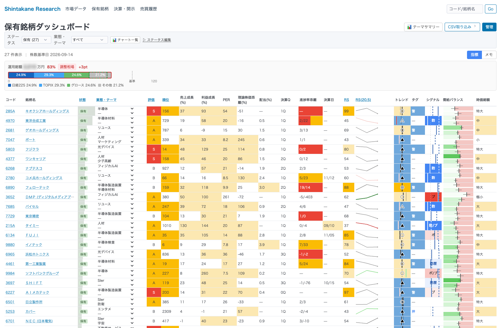
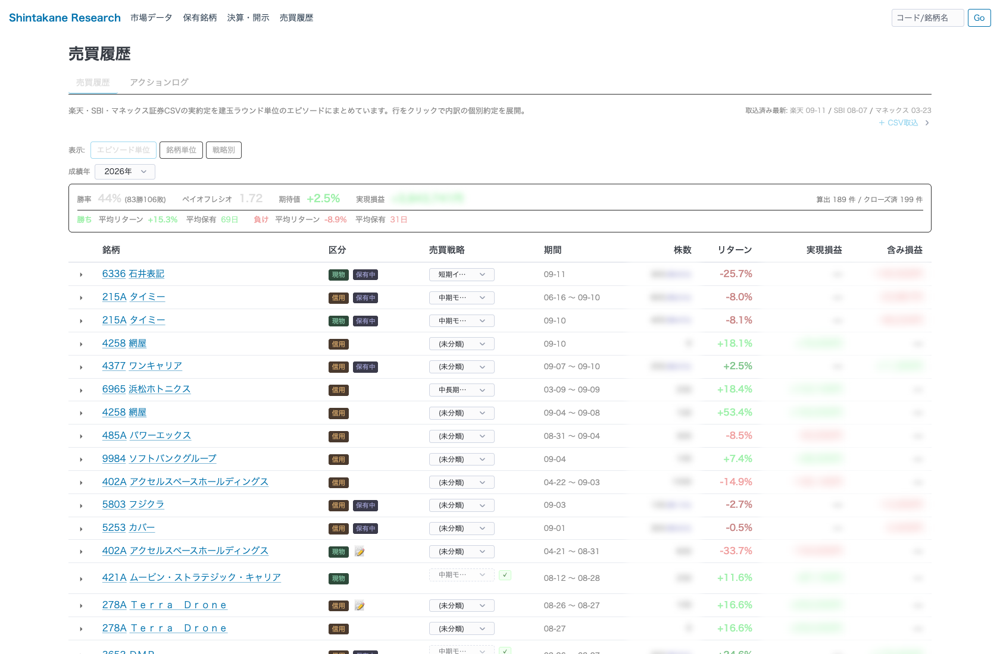
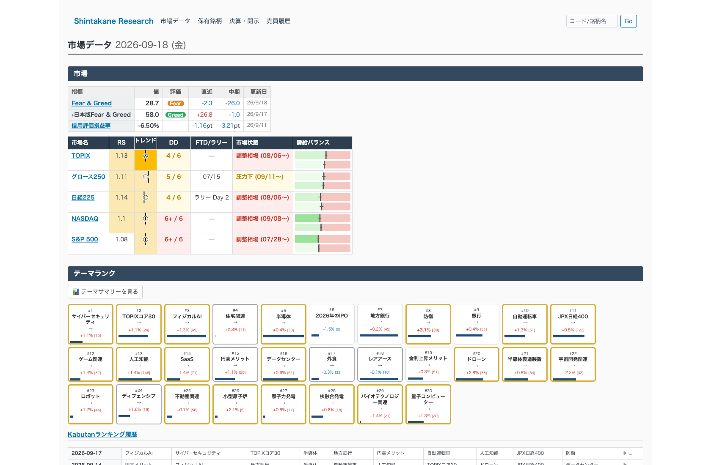
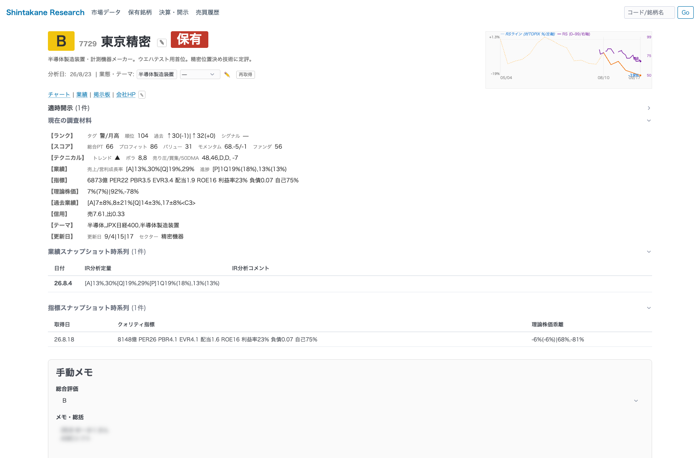

# Shintakane 機能紹介

日本株の成長株投資を支える個人開発システム「Shintakane」の画面紹介。
システムの思想・数式レベルの詳細は [システム概要.md](システム概要.md)、
アーキテクチャは [ARCHITECTURE.md](ARCHITECTURE.md) を参照。

> スクリーンショットは 2026-09-19 時点のもの。
> 運用総額・実現損益・株数・情報源の人名はぼかし処理済み。
> 勝率・ペイオフレシオ・リターン率はシステムの機能説明に必要なため残している。

役割分担の考え方:

```text
Shintakane = 記憶・数値・監視・規律
LLM        = 調査・解釈・比較・反証
人間       = 最終投資判断・サイズ・時間軸
```

「AI で銘柄を当てる」のではなく、**裁量投資の再現性を高める**ことを目的としている。

---

## 1. 保有銘柄ダッシュボード — 持っている銘柄を1画面で監視する



保有中の全銘柄について、業績・バリュエーション・モメンタム・需給を1行に並べる。
個別銘柄のページを開かなくても、ポートフォリオ全体の状態を横断で比較できる。

主な列:

| 分類 | 内容 |
|---|---|
| 評価・順位 | 独自スコアによる S/A/B 評価と全銘柄中の順位 |
| 業績 | 売上成長率、利益成長率、決算進捗率の乖離、次回決算日 |
| バリュエーション | PER、理論株価との乖離、配当利回り |
| モメンタム | 相対強度 (RS)、RSラインのスパークライン、トレンド判定 |
| 需給・シグナル | 売り圧力レシオのゲージ、出口シグナル、ステージ判定 |
| 判断の記録 | 売買戦略、IN理由、売買メモ |

上部のバーは**運用比率ガイド**。市場状態 (この例では「調整相場」) に応じて
推奨エクスポージャーを提示し、現在の配分 (日経225 / TOPIX / グロース / その他) と
基準値との距離を表示する。相場環境に対してポジションが重すぎないかを常に見える化している。

---

## 2. 売買履歴 — 実約定から成績を再構成し、判断を振り返る



楽天・SBI・マネックス証券の約定CSVを取り込み、**建玉が 0 → 建 → 0 に戻る1サイクル**を
1エピソードとして再構成する。手入力ではなく実約定が真実源なので、記録漏れが起きない。

上部の成績サマリー (この例は 2026年):

| 指標 | 値 | 意味 |
|---|---|---|
| 勝率 | 44% (83勝106敗) | 勝ちトレードの比率 |
| ペイオフレシオ | 1.72 | 平均利益 ÷ 平均損失 |
| 期待値 | +2.5% | 1トレードあたりの期待リターン |
| 勝ち | 平均 +15.3% / 69日 | 勝ちトレードの平均リターンと保有日数 |
| 負け | 平均 -8.9% / 31日 | 負けトレードの平均リターンと保有日数 |

勝率が 5 割を切っていても、**勝ちを長く持ち負けを短く切る**ことで期待値がプラスになる、
という中期モメンタム投資の構造がそのまま数字に出ている。

行を展開すると個別約定の明細が見え、エピソードごとに売買戦略のタグ付けと
振り返りメモを残せる。「エピソード単位 / 銘柄単位 / 戦略別」でビューを切り替えられ、
どの戦略が機能しているかを比較できる。

---

## 3. 市場データ — 相場環境を判定してから個別銘柄を見る



「今はリスクを取る局面か」を先に判定するためのページ。

- **センチメント**: 米国版 Fear & Greed、日本版 Fear & Greed、信用評価損益率
- **市場状態**: TOPIX / グロース250 / 日経225 / NASDAQ / S&P500 について、
  相対強度、トレンド、ディストリビューションデイ数、フォロースルーデイ、
  市場状態 (調整相場 / 圧力下 / 上昇相場) を判定
- **テーマランク**: 株探のテーマを騰落率と構成銘柄数つきで30位まで表示。
  資金がどのテーマに向かっているかを日次で追跡し、履歴も保持する

市場状態はダッシュボードの運用比率ガイドと連動していて、
調整相場ではポジションを軽くするよう促す設計になっている。

---

## 4. 銘柄詳細 — 調査の履歴を時系列で蓄積する



個別銘柄の調査内容を**時点付きで**貯めていくページ。
現在値だけでなく「いつ何を見て、どう考えたか」が残ることに価値がある。

- **現在の調査材料**: ランク、スコア内訳 (プロフィット / バリュー / モメンタム / ファンダ)、
  テクニカル、業績成長率と進捗、指標、理論株価、信用需給、所属テーマ
- **業績スナップショット時系列**: 決算ごとの定量データと分析コメントの履歴
- **指標スナップショット時系列**: 時価総額・PER・PBR などの推移と理論株価乖離
- **手動メモ**: 総合評価と投資仮説。右上には相対強度チャート

同じ銘柄を数ヶ月後に見直したとき、前回の判断根拠と当時の数字がそのまま残っているため、
仮説が当たったか外れたかを検証できる。

---

## システムの全体像

```text
データ取得 (株探・yfinance・適時開示)
      ↓
DB更新 (銘柄評価・調査記録・ポートフォリオ)
      ↓
スコアリング・ランキング
      ↓
WebApp (4画面) ← 人間が判断
      ↓
証券会社CSV取込 → 売買履歴 → 振り返り → ルール修正
```

最後の「振り返り → ルール修正」を月次で回す仕組みを整備中 (issue #448)。
記録した数字を投資原則と照合し、翌月変えるルールを1つだけ決める運用を目指している。

## 技術スタック

- Python 3.11、Flask、pandas、scipy、yfinance
- shelve ベースの軽量DB (銘柄評価・調査記録・ポートフォリオを分離)
- MCP サーバー経由で LLM からデータ参照が可能 (四季報コメント等)
- 開発は Claude Code を中心としたコーディングAI活用
